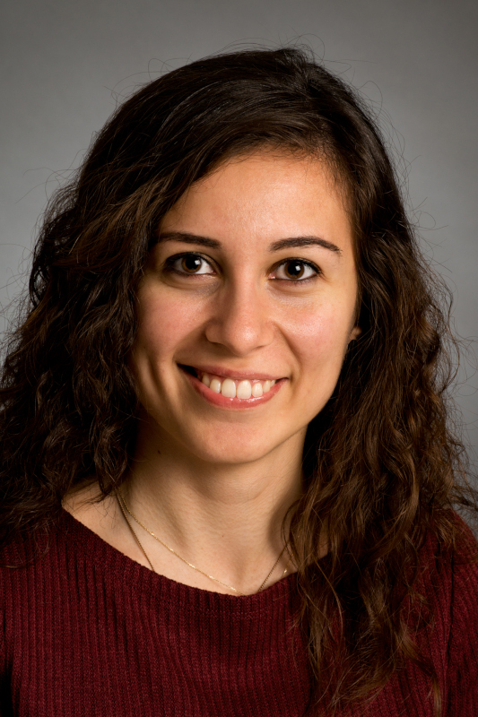

PhD student at Department of Clinical Medicine, Aarhus University. Employed at Department of Clinical Epidemiology, Aarhus University Hospital. Main research area: Perinatal pharmaco-epidemiology.

Other experiences;

* Almost three years experience as scientific assistant at Department of Clinical Medicine, Aarhus University in the area of clinical epidemiology. Main tasks: EU project Real world Outcomes across the Alzheimer's Disease spectrum for better care: Multi-modal data Access Platform (ROADMAP), Multi-database drug safety study in collaboration with PHARMO Institute and several research projects, especially in the field of Reproductive Epidemiology (2017-2019).

* Two year of work experience as statistician at Department of Clinical Epidemiology, Aarhus University Hospital. Main tasks; reporting, analyzing and managing clinical databases (2015-2017).

* Master's degree in Statistics from Aarhus University. Master's thesis in multiple imputation in collaboration with the Department of Statistics and Department of Biostatistics at Aarhus University (2015).

* One year of work experience as statistician student worker at Aarhus University Hospital, Department of Clinical Epidemiology (2015).

* One semester study abroad at Ege University, Izmir, Turkey (2014).

* Bachelor's degree in Mathematical Modelling from Aarhus University (2013). 

```{r, echo=FALSE, out.width="20%", fig.align = 'right'}

```